# AI Resume Builder - System Architecture Documentation

## Professional Mermaid Diagrams for Graduation Report

---

## 1. System Architecture Overview

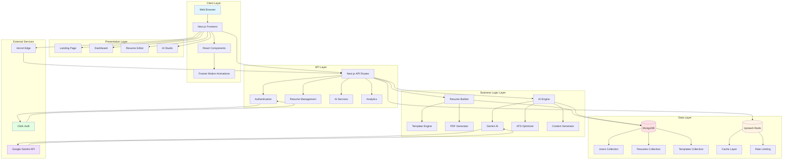

---

## 2. High-Level System Architecture

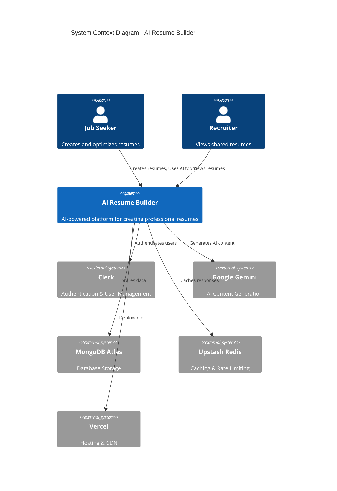

---

## 3. Component Architecture

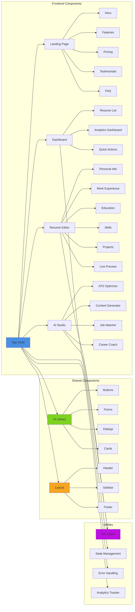

---

## 4. Data Model - Entity Relationship Diagram

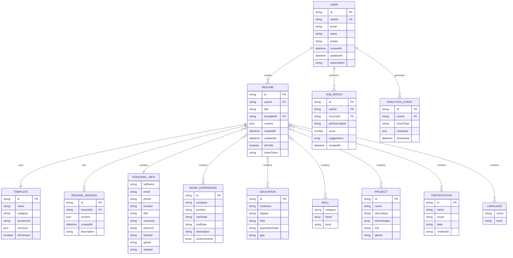

---

## 5. User Authentication Flow

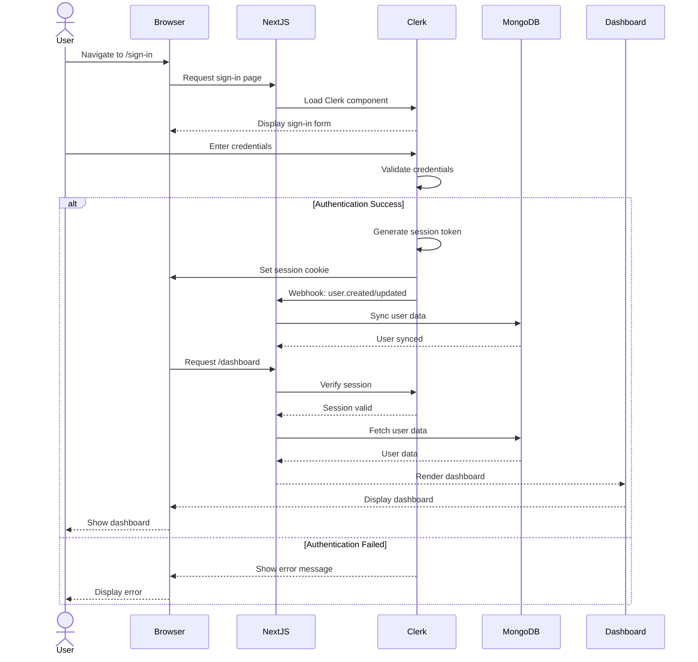

---

## 6. Resume Creation Workflow

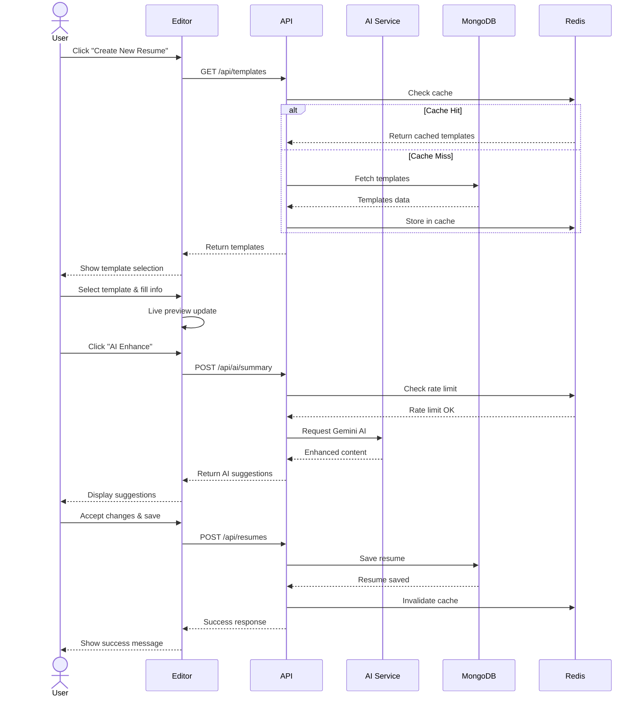

---

## 7. AI Content Generation Flow

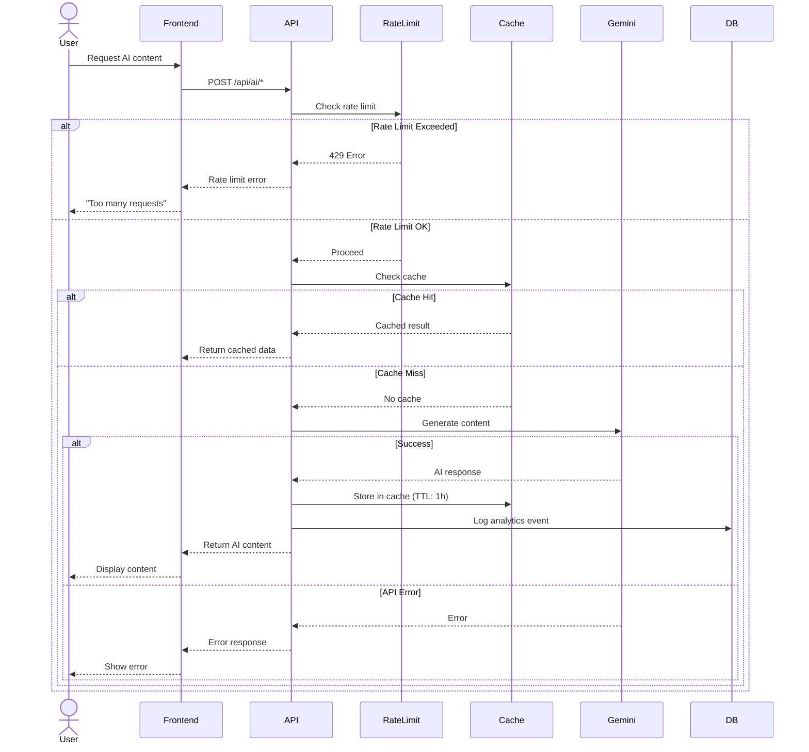

---

## 8. ATS Optimization Process

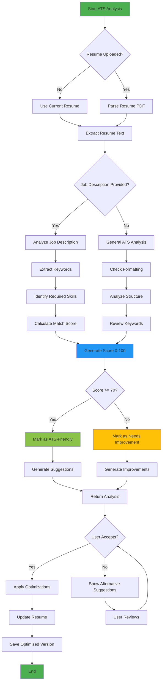

---

## 9. State Machine - Resume Editor

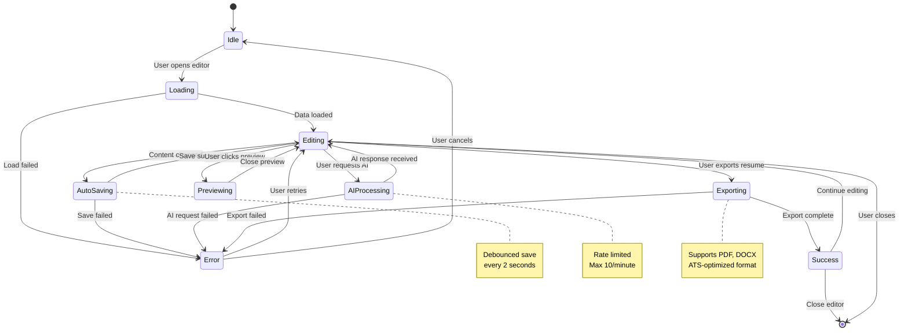

---

## 10. Class Diagram - Core Domain Models

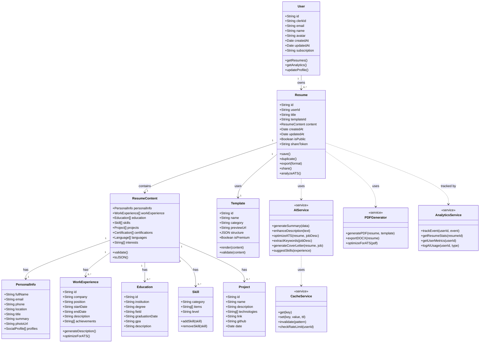

---

## 11. API Layer Architecture

```mermaid
graph TB
    subgraph "Client Requests"
        A[Browser/Mobile] --> B[Next.js API Routes]
    end
    
    subgraph "Middleware Layer"
        B --> C[Authentication]
        B --> D[Rate Limiting]
        B --> E[Error Handling]
        B --> F[Request Validation]
    end
    
    subgraph "API Endpoints"
        G[/api/resumes] --> G1[GET List]
        G --> G2[POST Create]
        G --> G3[PUT Update]
        G --> G4[DELETE Remove]
        
        H[/api/ai] --> H1[Summary Generation]
        H --> H2[Description Enhancement]
        H --> H3[Skill Suggestions]
        H --> H4[Bullet Points]
        
        I[/api/ats] --> I1[Analyze Resume]
        I --> I2[Job Matcher]
        I --> I3[Optimize Content]
        
        J[/api/analytics] --> J1[Track Event]
        J --> J2[Get Stats]
        J --> J3[User Metrics]
        
        K[/api/templates] --> K1[List Templates]
        K --> K2[Get Template]
    end
    
    subgraph "Business Logic"
        L[Resume Service]
        M[AI Service]
        N[ATS Service]
        O[Analytics Service]
        P[Template Service]
    end
    
    subgraph "Data Access"
        Q[(MongoDB)]
        R[(Redis Cache)]
    end
    
    subgraph "External APIs"
        S[Google Gemini]
        T[Clerk Auth]
    end
    
    C --> T
    D --> R
    
    G1 --> L
    G2 --> L
    G3 --> L
    G4 --> L
    
    H1 --> M
    H2 --> M
    H3 --> M
    H4 --> M
    
    I1 --> N
    I2 --> N
    I3 --> N
    
    J1 --> O
    J2 --> O
    J3 --> O
    
    K1 --> P
    K2 --> P
    
    L --> Q
    M --> S
    M --> R
    N --> S
    O --> Q
    P --> Q
    P --> R
    
    style B fill:#4A90E2
    style Q fill:#E74C3C
    style R fill:#F39C12
    style S fill:#9B59B6
    style T fill:#1ABC9C
```

---

## 12. Deployment Architecture

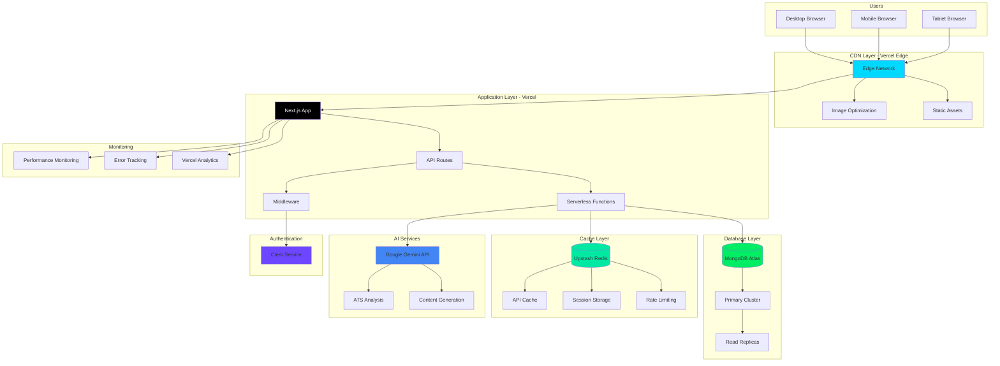

---

## 13. Resume Export Process

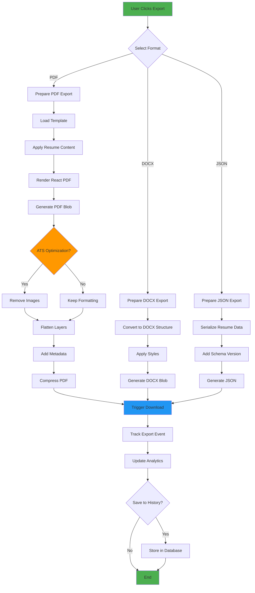

---

## 14. Caching Strategy

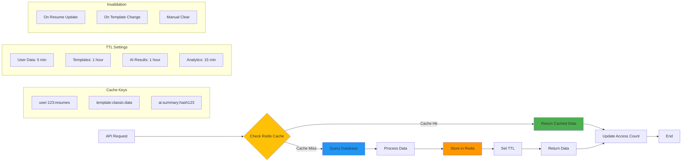

---

## 15. Security Architecture

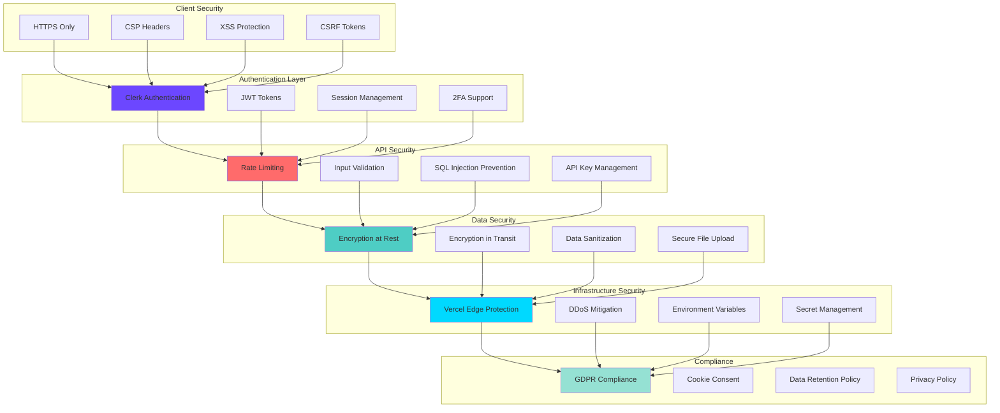

---

## 16. Analytics & Monitoring Flow

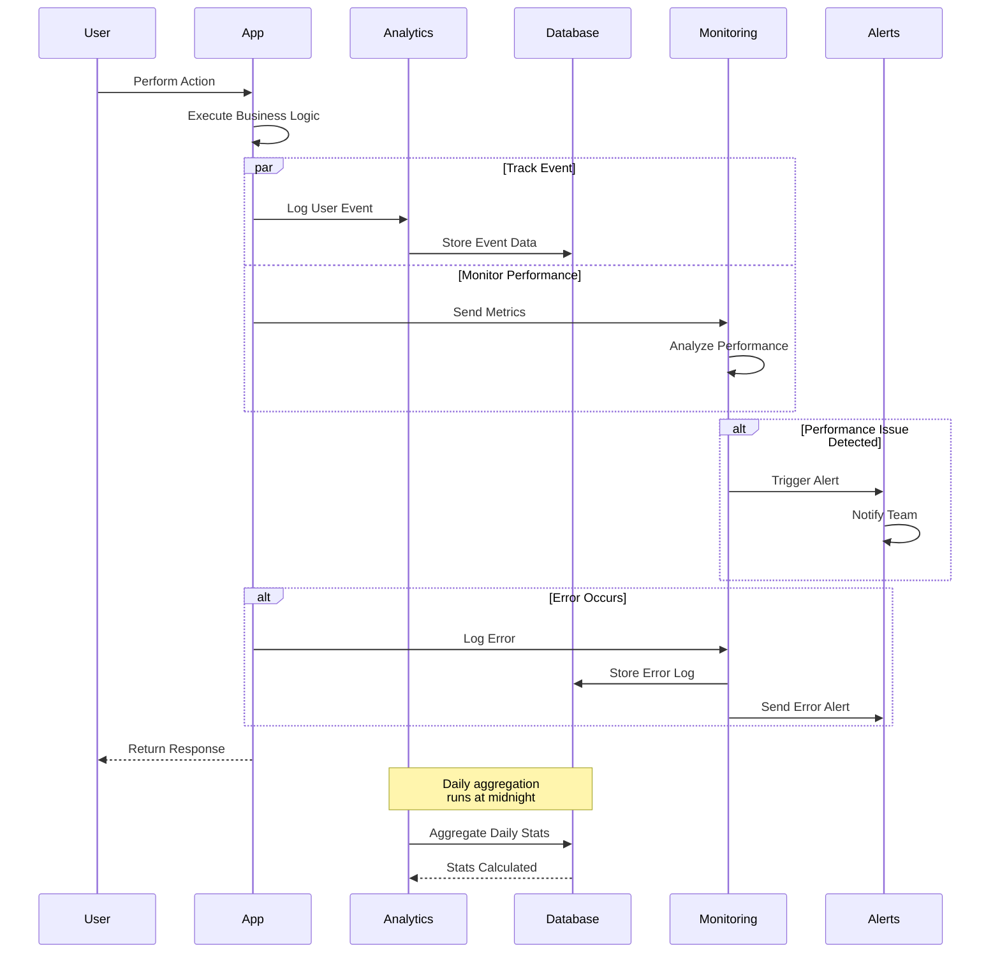

---

## 17. Mobile Responsive Design System

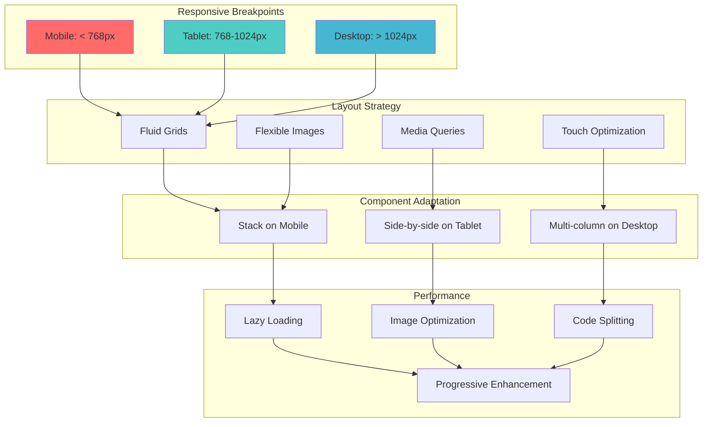

---

## 18. Feature Module Structure

```mermaid
graph TB
    subgraph "Core Features"
        A[Resume Builder] --> A1[Template Selection]
        A --> A2[Content Editor]
        A --> A3[Live Preview]
        A --> A4[PDF Export]
        
        B[AI Studio] --> B1[ATS Optimizer]
        B --> B2[Content Generator]
        B --> B3[Job Matcher]
        B --> B4[Career Coach]
        
        C[Dashboard] --> C1[Resume Management]
        C --> C2[Analytics View]
        C --> C3[Profile Settings]
        C --> C4[Billing]
    end
    
    subgraph "Supporting Features"
        D[Authentication]
        E[User Management]
        F[Template Library]
        G[File Storage]
    end
    
    subgraph "Cross-Cutting Concerns"
        H[Error Handling]
        I[Logging]
        J[Caching]
        K[Rate Limiting]
    end
    
    A --> D
    B --> D
    C --> D
    
    A --> F
    A --> G
    B --> J
    B --> K
    
    A --> H
    B --> H
    C --> H
    
    A --> I
    B --> I
    C --> I
    
    style A fill:#4A90E2
    style B fill:#7ED321
    style C fill:#F5A623
    style H fill:#E74C3C
```

This comprehensive set of Mermaid diagrams provides a professional, detailed view of your AI Resume Builder architecture suitable for a graduation report book. Each diagram focuses on different aspects of the system, from high-level architecture to specific workflows and technical details.
